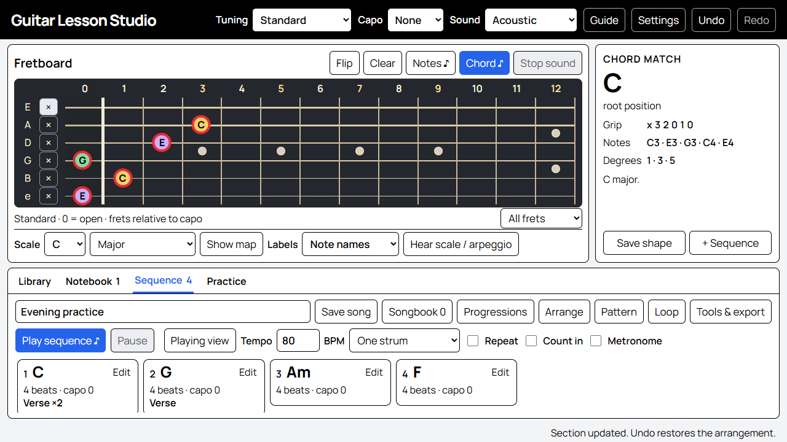

# Guitar Lesson Studio

**Explore chords. Build a piece. Practice with your guitar.**

A browser-based guitar workbench with an interactive fretboard, chord recognition, sampled guitar sounds and a composition studio. Version **0.8.0**.



*Actual application screenshot using a demonstration composition.*

## Install and open

You need **Node.js 22 or newer** and a current browser.

1. Download or clone the source and extract it into a folder.
2. Install Node.js if needed. Check with `node --version` in a terminal.
3. On Windows, double-click **Start Guitar Lesson Studio.cmd**. It starts the local server and opens your default browser. The older launcher name also works.

On Windows, macOS or Linux, you can instead open a terminal in the project folder and run:

```sh
npm start
```

Open **http://127.0.0.1:4173/**. Keep that terminal running; Ctrl+C stops the server. There are no application dependencies to install and no build step for local use. Use the server instead of double-clicking `index.html`.

If the launcher opens a browser without your saved work, return to your previous browser/profile. Each profile and site address has separate storage.

## Try it in two minutes

1. In **Library**, select a familiar shape. The neck shows its notes; the right panel identifies the chord.
2. Click **Chord ♪** to strum it or **Notes ♪** to hear separate notes. Choose Acoustic or Clean electric in the top bar.
3. Open **Sequence → Progressions**, choose a key and select **Use progression** on a card.
4. Click **Play sequence ♪**. **Playing view** shows the current and next chord.
5. Give your piece a title and click **Save song**. Open **Guide** for instructions and examples.

## What you can do

| Tool | Functions |
| --- | --- |
| **Fretboard** | Select/mute notes, recognize chords and intervals, flip string order and place a capo. Physical fret markers help navigation. |
| **Tunings** | Standard, Drop D, DADGAD, Open G, Open D and Half-step down. Notes, chord recognition, generated grips, scales and audio follow the tuning. |
| **Library** | 56 familiar Standard-tuning shapes, chords in a key, triad inversions and a 15-quality chord finder. |
| **Scales & arpeggios** | Major, minor, pentatonic and blues maps. Play across all six strings, a single octave or the selected grip with exact fret highlights; choose direction, position, tempo and repeat. |
| **Sequence** | Add chords/rests, change duration/direction, reorder or copy steps, transpose and compare capo options or smoother grips. |
| **Arrange / Pattern / Loop** | Name and repeat sections, copy/move them, customize strum patterns and step overrides, or practice a chosen passage. |
| **Songbook** | Save named pieces with notes, key, tempo, rhythm and arrangement. Update or copy songs. |
| **Notebook** | Save, search, duplicate and recall grips with personal notes; print study sheets. |
| **Practice** | Ten-question note-finding, note-naming and interval-listening exercises. Neck quizzes use Standard tuning without a capo. |
| **Export** | MIDI, WAV, text tab, JSON backups and printable song sheets with chord diagrams. |

## Read the neck and use the controls

The thin treble string is at the bottom by default; Flip reverses the view. String labels show note names without numbers. **×** mutes; **0** is open. Frets count from the capo; physical fret numbers appear in parentheses. Diagrams read bass to treble.

**Colors:** each of the twelve pitch classes has its own color, consistent across the neck and all octaves. C♯ and D♭ share a color because they are the same pitch. A **red ring** marks your selected notes; a separate **blue outer halo** follows playback. Labels can show note names or chord degrees.

**Fret range:** use the menu beneath the neck to see all frets or enlarge frets 0–4, 4–8 or 8–12. Changing the view keeps your grip intact; the caption counts selected notes outside the view. Playback temporarily shows the full neck and restores your view afterward. Printed and Playing view diagrams retain the full neck.

**Stop sound ends all current audio**, including repeating playback and metronome clicks. It never clears your selection, deletes a song or erases your work. It is disabled when nothing is playing. **Pause / Resume** holds and continues playback from the same point.

**Settings → Note names** chooses sharps/flats: C♯ and D♭ describe the same pitch. This changes labels, not sound. Settings also controls volume, tone and full screen where supported.

**Tuning** retunes the virtual guitar; tune your real instrument separately. Saved grips and sequence steps remember their own tuning. Familiar **Shapes** select Standard when loaded. **Key family**, **Triads**, **Chord finder** and **Progressions** generate grips for the current tuning. A mixed-tuning piece requires retuning a real guitar between those steps.

Keyboard: arrows navigate the neck; Enter selects; Escape stops sound/closes a dialog; Space plays/stops a sequence outside a control. **Undo / Redo** remembers 40 edits until reload. Use Ctrl/Cmd+Z to undo, Ctrl/Cmd+Shift+Z or Ctrl+Y to redo. Text fields keep their normal editing shortcuts. A new edit clears the redo branch.

**Scale coverage:** Hear scale / arpeggio defaults to All six strings. It plays every scale position in the chosen fret range, string by string from bass to treble; Reverse retraces the pattern. Wider ranges include repeated pitches at different positions. Choose One octave for a shorter exercise. The visual scale map covers all six strings in either mode.

**Practice speed:** in Settings, enable gradual increases, choose an increment, a number of complete passes and a target tempo. For example, start at 80 BPM and add 5 BPM every four passes until 120 BPM. Enable Repeat on a sequence or fretboard exercise, or loop a passage. The displayed tempo changes at the start of the next pass. Pause holds your place; Stop and Play starts again at the original tempo. A target below your starting tempo never slows playback. Saved song tempos and MIDI/WAV exports stay unchanged.

## Keep your music safe

The draft, notebook and songbook are saved in browser local storage. **Settings → Back up my music → Download JSON** creates a complete backup; **Notebook → Export** opens the same window. After checking your saved file, choose **I saved this backup**. Settings shows the last date you confirmed in this browser; requesting a download alone does not count as a confirmed backup. That date stays separate from your music and is not imported or exported. Restore with **Import**, or paste a backup into the Export window and choose **Merge this JSON**. Existing records are kept; Undo can reverse an import.

Back up before changing browser, device or site address. The local app and a future Firebase copy have **separate storage**; transfer music with JSON export/import. Concurrent tabs detect conflicting edits and pause editing until reload.

New backups use schema 5; versions 1–4 are accepted with Standard tuning. Older storage keys are retained. Clearing browser data can remove saved music. There is no cloud synchronization.

## Limits and practical notes

- Up to 250 notebook entries, 40 songs and 128 stored steps per piece. Sections can play 1–8 times, with at most 1,024 expanded steps.
- Tempo: 40–180 BPM. Steps: 1, 2 or 4 beats. The transport uses four-beat bars.
- Exports include one arranged pass with section repeats and step rhythms; practice loops, count-in and metronome are omitted. WAV is mono 44.1 kHz, up to three minutes. MIDI timbre depends on the player.
- Audio uses bundled recordings with pitch transposition. High acoustic notes can sound thinner. No microphone recording, automatic tuning, physical-playing assessment or AI teacher is included.
- Desktop layouts keep the main workbench on screen. Long lists scroll inside panels; phones, browser zoom and short windows may need scrolling to keep text readable.

## Development and hosting

```sh
npm test                  # Music, storage, timing and export tests
npm run build             # Create dist/ from explicit public files
npm run release:candidate # Create release/github-source/ for review
npm run audit:release     # Check both candidates and their hashes
```

The build commands replace their generated folders. Keep personal files elsewhere. Review the candidate before publishing; do not upload the working folder wholesale.

Browser checks use Playwright and a separate muted Edge profile. Install it as a development tool (`npm install --no-save playwright`), start the app, then run `node scripts/verify-v6.mjs`, `node scripts/verify-v6-features.mjs`, `node scripts/verify-v7.mjs` and `node scripts/verify-v8.mjs`. Override `PLAYWRIGHT_PATH` or `BROWSER_PATH` if needed. `node scripts/verify-http.mjs` checks the server boundaries.

See the [Firebase plan](FIREBASE_PLAN.md), [security and privacy notes](SECURITY.md) and [release checklist](GITHUB_RELEASE_CHECKLIST.md). Firebase deployment is not automatic; its configuration serves only generated `dist/` content.

## Credits and licensing

Guitar Lesson Studio was created using OpenAI Codex with ChatGPT-6 Astra.

Acoustic/electric recordings come from **tonejs-instruments**, with source credits to the University of Iowa and Karoryfer, under **CC-BY 3.0**. **Manrope** uses **SIL OFL 1.1**. See [sound and font credits](SAMPLE_CREDITS.html), the asset licenses and the relative-path hash manifest.

A source-code license has not yet been selected. Third-party asset licenses remain in effect; a public open-source release should include an explicit source license.
